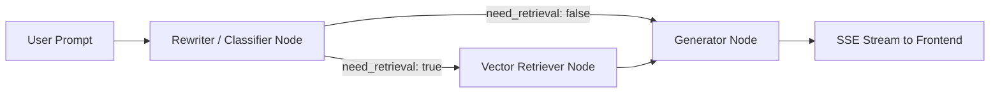

# QnA Bot with Docs 💬📄

A production-grade, full-stack AI Document Q&A and Research Assistant built with **FastAPI**, **LangGraph**, **LangChain**, **PostgreSQL / Supabase**, and **React (Vite)**.

---

## 🌟 Key Features

- **Multi-Turn Adaptive RAG**: Powered by LangGraph state machine with query rewriting, conditional retrieval routing, and streaming answer generation.
- **Resilient Dual-Model Architecture**:
  - **Primary Model**: Google Gemini (`gemini-3.6-flash` / native structured output).
  - **Fallback Model**: NVIDIA NIM (`nvidia/nemotron-3.5-lightning-30b-a3b` + robust schema parsing).
- **Real-Time Streaming UI**:
  - Incremental token streaming over Server-Sent Events (SSE).
  - Live pipeline status pills (*Analysing query...*, *Searching knowledge base...*).
  - Collapsible real-time model thinking / reasoning display with live timers.
- **Interactive Conversation Tree**:
  - Branch switching, inline prompt editing, message regeneration, and tree traversal.
  - Automatic background LLM title generation.
- **Document Management**:
  - Drag-and-drop file upload (PDF, TXT, MD).
  - In-browser document viewer with inline metadata and deletion guards.
- **Anonymous Sessions**:
  - Automatic 24-hour anonymous session isolation using secure HttpOnly cookies.
- **Responsive Modern Design**:
  - Glassmorphic UI with light/dark theme switching, fluid animations, and smooth auto-scrolling.

---

## 🏗️ Architecture



---

## 🚀 Getting Started

### Prerequisites

- **Python 3.11+**
- **Node.js 18+** & **npm**
- **PostgreSQL / Supabase** instance

---

### Backend Setup

1. Navigate to the backend directory:
   ```bash
   cd backend
   ```

2. Create a virtual environment and install dependencies:
   ```bash
   python -m venv .venv
   source .venv/bin/activate  # On Windows: .venv\Scripts\activate
   pip install -r requirements.txt
   ```

3. Configure environment variables:
   ```bash
   cp .env.example .env
   ```
   Fill in your `DATABASE_URL`, `GEMINI_API_KEY`, `NVIDIA_API_KEY`, and optional `LANGCHAIN_API_KEY`.

4. Start the backend server:
   ```bash
   python -m uvicorn app.main:app --host 127.0.0.1 --port 8000 --reload
   ```

---

### Frontend Setup

1. Navigate to the frontend directory:
   ```bash
   cd frontend
   ```

2. Install dependencies:
   ```bash
   npm install
   ```

3. Configure environment variables (optional):
   ```bash
   cp .env.example .env
   ```

4. Start the frontend development server:
   ```bash
   npm run dev
   ```
   Open [http://localhost:5173](http://localhost:5173) in your browser.

---

## 🛠️ Tech Stack

- **Backend**: FastAPI, SQLAlchemy (Asyncpg), LangGraph, LangChain, Pydantic v2, Tenacity
- **Frontend**: React 18, Vite, React Router 6, Tabler Icons, React Markdown, Highlight.js
- **Database**: PostgreSQL (Supabase / asyncpg connection pool)
- **Observability**: LangSmith OpenTelemetry Tracing & structured JSON logging

---

## 📄 License

MIT License.
